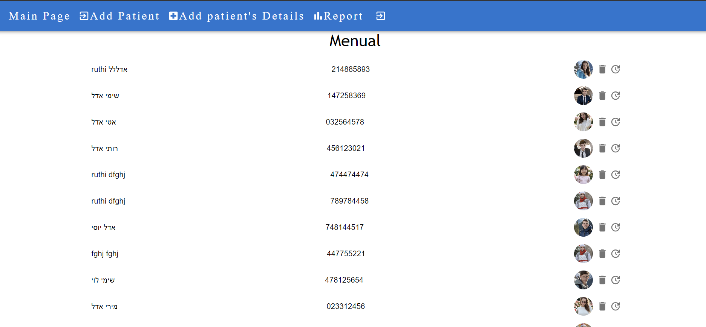
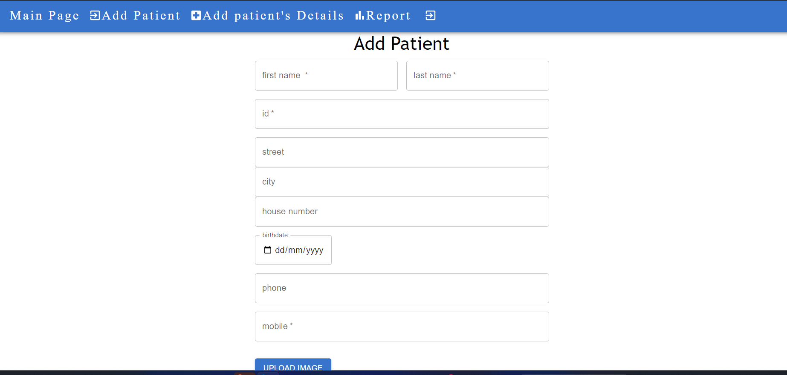
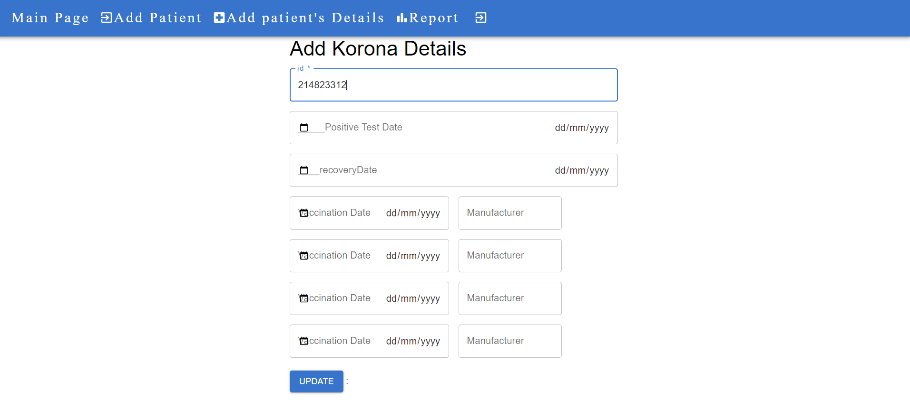
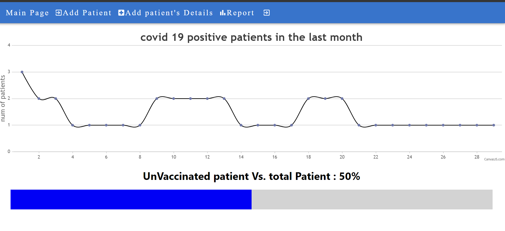

# Project Name
HMO website
## Overview

Overview

The project is a web-based system that manages health insurance members' information. It consists of both client-side and server-side components.
Client-side

On the client-side, the system displays a list of all members in the health insurance fund. Users can view details of each member by selecting them from the list. The member's card displays various information, including the date of their COVID-19 vaccination, the date they were infected (if applicable), and their recovery date. The client-side interface is designed to be minimalist, clean, and intuitive. It supports actions such as adding new members, deleting, editing existing members, and querying the database for member details.

Highlights:

    Utilizes technologies such as React, Redux, and React Hook Form for state management and form handling.
    Supports basic CRUD operations for managing members' data.
    Provides an interface for querying member information from the server-side.

Server-side

The server-side component provides full CRUD functionality and access to the database. It ensures the correctness of input data and prevents errors. The server-side exposes an API for communication with the client-side.


Additional Information

In addition to implementing robust security measures, the project leverages token-based authentication and role-based access control (RBAC) to enhance user access rights. By utilizing tokens, the system ensures secure communication between the client and server, verifying the authenticity of users and protecting against unauthorized access. Moreover, the integration of RBAC allows for fine-grained control over user permissions, enabling administrators to assign specific roles to users based on their responsibilities within the system. Furthermore, Redux is employed for efficient state management, facilitating seamless interaction and data flow across different components of the application. These security measures, combined with Redux for state management, fortify the project against potential security threats and ensure the integrity and confidentiality of user data.

Bonus Questions

    Image Upload: Allows users to upload and display a member's picture on the client-side.
    Architectural Specification: Provides an architectural specification detailing the interaction between different services and APIs, along with a conceptual view of the data in the database.
    COVID-19 Summary Display:
        Displays a summary view of COVID-19-related data, such as the number of active cases per day in the last month (preferably as a graph).
        Identifies the number of members who are not vaccinated at all.
## Usage

to use the project you first have to make an account with the specific role user/doctor
in every other entry if you are not conected to the website you will need to log in
after connecting to the website you can use the navbar to navigate through the pages
pages are:
1. add patient
2. add/update patient covid-19-details
3. view patients -menual
4. covid 19 report
   
### Client-side Screenshots






## Installation

### Dependencies

Before running the project, make sure you have the following dependencies installed:

- [https://github.com/ruthiedel/ruthiEdelHmo]([https://github.com/user/dependency-a](https://github.com/ruthiedel/ruthiEdelHmo))
- [https://github.com/ruthiedel/hmo-server]([https://github.com/user/dependency-b](https://github.com/ruthiedel/hmo-server))

### Setup Instructions

1. Clone the main project repository:

    ```bash
    git clone https://github.com/user/project.git
    ```

2. Navigate to the project directory:

    ```bash
    cd project
    ```

3. Initialize and update dependencies:

    ```bash
    git submodule init
    git submodule update
    ```

4. Follow the instructions in the respective README files of each dependency repository to complete their setup.

### Testing

To test the installation, run the following command:

```bash
npm test
```


## Server-side

1. Clone the repository:

git clone https://github.com/ruthiedel/hmo-server


Install dependencies:


```bash
cd server
npm install
```

Start the server:


```bash
    node index
```
Client-side

    Install dependencies:

```bash

cd client
npm install
```

Start the client:

```bash

    npm start
```

External Dependencies


